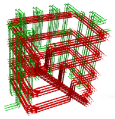
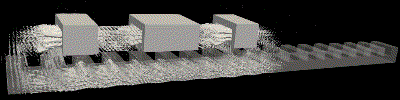
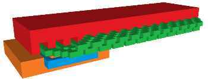
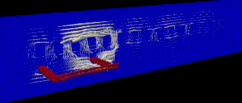

---

### Calculation of three-dimensional magnetostatics using the equivalent circuit method (ECM).  
&emsp; The results of a study of the equivalent circuit method (ECM) for solving three-dimensional magnetostatic problems are presented. Mathematical formulations, algorithms, and Fortran code are provided.  
&emsp; For research purposes, a simple-to-use tool has been developed for the initial stages of magnetostatic calculations with minimal requirements for the structure's geometry.
The computational space contains field sources—coils of arbitrary geometric configuration and with a specified current density (in the low-frequency range), ferromagnets with a specified magnetic permeability and arbitrary geometric configuration. The coils and ferromagnets can move at a specified velocity. For a stationary ferromagnet, nonlinearity B(H) is possible.

### 1 Calculation method
&emsp; The computational domain is divided into rectangular prismatic cells (a rectangular three-dimensional mesh). The edge of each cell is modeled by a resistive branch. The branch resistance is numerically equal to the magnetic resistance. The resulting electrical circuit is calculated using loop analysis. The sources are the loop emfs, numerically equal to the densities of external current sources in the coils. The resulting branch currents are numerically equal to the magnetic flux density at the cell edge. The matrix of loop resistances and branch currents is calculated using topological matrices. (This can be considered a variant of the equivalent magnetic circuit method.)  
&emsp; Let us note one feature of the method that is of research interest. The contour matrix used is overdetermined. It turned out that the simplest method of successive  over relaxation (SOR) finds a solution quite quickly (see section [8 Examples](#ex)). More detailed information is contained in files [Readme.md](./doc/README.md) and [Validations.pdf](./doc/Validations.pdf) in the  [/doc](./doc) folder.

### 2 Required Software 
The build and testing was done under _Windows_ (possibly _Linux_ too, but it hasn't been fully tested yet).  
-  [**VoxCad**](https://sourceforge.net/projects/voxcad/files/VoxCAD1000-x64.msi/download), ([here](https://sourceforge.net/projects/voxcad/files/VoxCad0992.tar.gz/download) is a version for  **Linux**) this voxel editor allows you to quickly create 3D images from rectangular parallelepipeds (cuboids). It is well suited for the calculation method under consideration, making it suitable for sketch calculations where precise geometric shapes are often not required. It should also be noted that geometric images in this editor can be accompanied by text data.  
- [**gfortran**](https://www.equation.com/servlet/equation.cmd?fa=fortran) (with **gcc**). Version 16.1 for Windows was used.  
- **make**  for build;  
- [**ParaView**](https://www.paraview.org/)  to display calculation results in **vtk** format files.  

### 3. Repository Structure
Folder **/src**: 

* **ECM_MS.f90**   main program; it also contains subroutines for multiplying and transposing sparse matrices, SOR solver, outputting results to vtk format, etc.
* **m_vxc2data.f90**  module for sharing data obtained when converting data from a **VoxCad** file; 
* **vxc2data.f90**  program for converting data from a **VoxCad** file, BiCGstab solver for calculating the direction of currents in windings;     
* **m_fparser.f90** - parser for calculating functions specified in the lines of a **VoxCad** file. Adapted from source files, available from <http://fparser.sourceforge.net>;  
* **uncompress.cpp**  for create a temporary file with converted uncompressed data into ASCII for later processing;  
* **/base64/base64.h** header file for  **uncompress.cpp**.  

&emsp;Files in **VoxCad** format with examples of tasks for calculations in the time domain:  

* **spirals.vxc** a spiral coil wound around a spiral magnetic core (test).
* **step_motor.vxc** linear stepper motor. 
* **LSM.vxc**  linear synchronous machine . 
* **test_team20.vxc** a task similar to the reference problem 20 for the TEAM workshop.  
* **test_MS.vxc** simple magnetostatic test for validation. 
* **BH-team20.txt** _B-H_ magnetization curve data.

Folder **/doc**:   

* [**Validations.pdf**](./doc/Validations.pdf) - results of validations
* [**Quick_guide.pdf**](./doc/Quick_guide.pdf) - quick guide to preparing data for calculations
* [**Readme.md**](./doc/README.md) - basic mathematical relationships

**Makefile**  creating an executable file using **make**.  

### 4. Build  
&emsp; To build the **ECM_MS.exe** executable file, **makefile** is used. Type **make** at the command prompt and run.  

### 5. Launch of calculation  
&emsp; At first, on need to save the data, for example **example.vxc**, to a working file named **in.vxc** in the same directory as the **ECM_MS.exe** executable.  
Next run the executable file: **ECM_MS.exe**. As a result, output files will be created: with extensions  **vtk**. 

### 6. Output information
&emsp; The calculation results are written to files with the extension **vtk**, which are located in the folder **/out**, where **out** - the name that is specified in the source data (this name is set by default). The following sets of files are generated:  
&emsp; **field_\*.vtk**  for displaying a 3D field and **src_\*.vtk** - for displaying coils on an unstructured grid. The number of files corresponds to the number of calculated points in time.

### 7. Validations and Quick guide.
 &emsp; Validation results and brief description located in files in the **/doc** folder in  files **Validations.pdf** and **Quick_guide.pdf**.  
 

### <a id="ex">8. Examples</a>
 &emsp;The examples below are of an exploratory nature, are limited to the calculation of magnetic fluxes and are not related to calculations in the design of industrial machines.

### 8.1 Arbitrary coil geometry and arbitrary magnetic core geometry test
A spiral coil wound around a spiral magnetic core was used for the tests.
&emsp;Below in  <a id="Fig.1">Fig.1</a> are screenshots taken in  **VoxCAD** (geometry prepared for **ECM_MS**).   Geometry and data for calculation in **ECM_MS** are contained in the file **spirals.vxc** in the directory **/src**  

|&emsp;  | &emsp;&emsp;| 
|  :-:                          |:-:   |
|a) geometry                    |b) magnetic flux density in a ferromagnetic   | 
|                               |  material and current density in the coil |

&emsp;&emsp;&emsp;&emsp; Fig.1. Screenshots of geometry and result of calculations   
&emsp;&emsp; Number of unknowns: 204073, number of iterations: 1360, computation time: 6.5 s.  

### 8.2 Linear electric machines
&emsp; Linear machines have a simple design that can be easily modeled using cuboids. This allows for the evaluation of mathematical and software solutions by performing calculations for various designs.

### 8.2.1  Linear stepper motor.
&emsp; In this modification of the linear stepper motor, current pulses are applied to windings located on the moving part, creating sequences of magnetic fields that interact with the stationary part of the motor, which has a toothed structure. This results in discrete movement over precisely defined distances—steps.
Below in  <a id="Fig.2">Fig.2</a> are screenshots taken in  **VoxCAD** (geometry prepared for **ECM_MS**).  The initial data for the task is in the file **step_motor.vxc** in the directory **/src**.   

|&emsp; |&emsp; | 
|  :-:                       |:-:   |
|a) design    |b) magnetic flux density in ferromagnets  | 
|                       | displayed in **Paraview**|

&emsp; Fig.2. Image of stepper motor design and magnetic flux density distribution .   
&emsp; Number of unknowns: 204740, number of initial iterations: 1990, сomputation time: 2.2s per time step.  

### 8.2.2. Linear synchronous machine (**LSM**) with longitudinal magnetic flux. 

&emsp;A three-phase winding is placed in a stationary magnetic core and creates a moving magnetic field, first in the positive **x**-axis direction, then in the opposite direction. A direct current is applied to the excitation winding, and it moves synchronously with the field of the three-phase winding. The velocity of the field **Vs** of the three-phase winding is **$2 \cdot \tau\cdot f$**, where **$\tau$** is the pole pitch, **f** is the frequency of the three-phase winding current.

||  |
|  :-:                             |:-: |
| a) design   |b) magnetic flux density in longitudinal section |

&emsp;&emsp; Fig.3. Sscreenshots of geometry created by **VoxCAD** and calculation results  obtained in **ECM_MS** and displayed in **ParaView**  
&emsp;&emsp;&emsp;&emsp;&emsp; Number of unknowns: 472857, number of initial iterations: 2010, сomputation time: on average 5.3s per time step .

 ***
Autor <a href="mailto:JNSresearcher@gmail.com">J.Sochor</a>

 *** 
