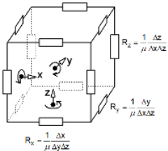
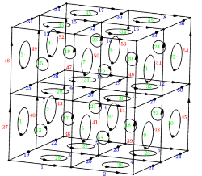

### Basic mathematical relationships

&emsp;The numerical calculation corresponds to the solution of partial differential equations with respect to the magnetic flux density vector **$\vec B$**
<table><tr> 
<td>

$$\nabla\times \left( \frac{1}{\mu_r} \nabla\times\vec{A} \right)  =  \mu_0 \vec{J}_s  &emsp;&emsp;&emsp; (1)$$ 

$$\vec{B} = \nabla\times\vec{A} &emsp;&emsp;&emsp;&emsp; (2)$$
</td>
</tr></table>  

where  **$\mu_0=4\pi\cdot 10^{-7}$** is magnetic constant, **$\mu_r$** relative magnetic permeability,  **$\vec{A}$** is vector potential,  **$\vec{J}_s$**  is density of external current source.  

&emsp;A number of publications (see [Bibliography](#bib)) have shown  that the numerical solution of equation (1),(2)  can be reduced to calculations of the equivalent electrical circuit. The presented work examines the results of the study of this approach.  
 

<a id="eq1">**Equivalent electrical circuit**</a>  
&emsp;The computational domain is divided into rectangular prismatic cells. The cells grid is associated with a rectangular three-dimensional mesh (displaced cells). The edge of the mesh is modeled by a resistive branch. The branch resistance is numerically equal to the magnetic resistance. The resulting electrical circuit is calculated using loop analysis. The sources are the loop emfs, numerically equal to the densities of external current sources in the coils. The resulting branch currents are numerically equal to the magnetic flux density at the mesh edge. The matrix of loop resistances and branch currents is calculated using topological matrices.  
&emsp;Fig. 1 shows the equivalent circuit for one mesh section and the topological representation of a rectangular prismatic mesh using a 3x3x3 area as an example. All contours of the rectangular mesh are used in the calculations. The interactive  [3D](https://github.com/JNSresearcher/ECM_MS/img/mesh.html) tab in Fig. 1b) shows the numbering of branches and contours in detail (you can rotate, move, etc.).  

|&emsp;  | &emsp;&emsp;| 
|  :-:                          |:-:   |
|a) resistive circuit for|b) topological diagram of a mesh with a 3x3x3 nodes count  | 
|  one mesh section | [**Click here**](https://github.com/JNSresearcher/ECM_MS/img/mesh.html) for interactive viewing 3d mesh|
&emsp;&emsp;&emsp;&emsp; Fig.1. Equivalent branches and topology of an electrical circuit

&emsp;**Some topological relations**  

*  **Nx, Ny, Nz** number of cells, respectively, along the **x, y, z** axes  
*  **Nx+1, Ny+1, Nz+1** number of nodes along the **x, y, z** axes respectively  
* Sum of all nodes: **Nsum = (Nx+1)\*(Ny+1)\*(Nz+1)**  
* Sum of all branches: **Vsum = Nx\*(Ny+1)\*(Nz+1) + (Nx+1)\*Ny\*(Nz+1) + (Nx+1)\*(Ny+1)\*Nz**  
* Sum of all contours: **Ksum = Nx\*(Ny+1)\*(Nz+1) + Nx\*(Ny+1)\*Nz +  Nx\*Ny\*(Nz+1)**  
* The following relationships are known for a connected electrical circuit: **Vsum = Kindep + (Nsum-1)**, where **Kindep** - number of independent contours,**(Nsum-1)** - number of nodal pairs  
* The number of independent contours: **Kindep = Vsum - (Nsum-1)** After substituting the expressions we have: **Kindep = 2\*Nx\*Ny\*Nz + Ny\*Nz + Nx\*Nz + Nx\*Ny**  
* Difference corresponds to the number of dependent contours: **dK = Ksum - Kindep =  Nx\*Ny\*Nz**  
* For the circuit shown in Fig. 1b : **Nsum = 27; Vsum = 54; Ksum =36; Kindep = 28; dK = 8** 

&emsp;The calculations use a topological contour matrix **$C_{KV}$** reflects the connection of branches into contours. The number of lines is equal to the sum of the number of contours, and the number of columns equals the number of branches. Each row contains +1 or -1 in the columns corresponding to the branch number included in the contour. If the direction of contour traversal coincides with the direction of the branch, then +1 is assigned; otherwise, -1.  

&emsp;**General algorithm of calculations:**  

   1. Calculation of the branch impedance matrix **$Z_{VV}$**. This is a one-dimensional vector, since the branches do not contain controlled sources;
   2. Formation of a topological matrix **$C_{KV}$** and its transposition: **$C_{VK}$**
   3. Contour matrix calculation **$Z_{KK} = C_{KV}\cdot Z_{VV} \cdot C_{VK}$**
   4. Formation of the vector of contour sources of emf **$E_K$**
   5. Solution of a system of equations **$Z_{KK} \cdot I_{K} = E_K$** relative to loops currents **$I_K$**. Since the contour matrix contains all contours, it is overdetermined. It turned out that the simplest method of successive over-relaxation (SOR) allows us to find a solution.
   6. Calculation of currents in branches **$I_V = C_{VK} \cdot I_{K}$**  
_Note_: All matrices are highly sparse and stored in CSR format.  

For domains with nonlinear ferromagnet’s, the algorithm is supplemented with simple iterations in a loop:  

   1. for each cell of the ferromagnetic domain, the current amplitude is calculated  **$Im = \sqrt(I_{Vx}^2 + I_{Vy}^2 + I_{Vz}^2)$** it is equal to the induction flux density **B** in the cell
  2. according to the table data **B-H** or **B-μ**, the magnetic permeability **μ** is calculated. 
  3. the found **μ**  are averaged over the domain volume
  4. the average values **μ** ​​are summed and compared with the average values ​​at the previous iteration (under-relaxation may be performed)
  5. if the difference satisfies the convergence criterion, then exit the iteration loop.  
   otherwise, new branch resistances are calculated for each domain **$Z_{VV}$**, contour matrix **$Z_{KK}$**, calculation of the system of equations and calculation of new currents in the branches **$I_V$**  
 transition to 1  
 
&emsp; &emsp; The evaluation of the algorithm validation results is given in the file [**Validations.pdf**](./Validations.pdf), is located in this folder.

<a id="eq2">**Algorithm for calculating current density in coils**</a>  
&emsp; The source of the field is the current carrying conductors. The input data define only the current amplitude (in ampere-turns) as a function of time and the geometric configuration of the conductor. The direction of current in conductors and its density is calculated using the following algorithm.  
&emsp; First, some scalar field is calculated in the coil region using the Laplace equation: **$\nabla^2 V =0$** with Dirichlet boundary conditions at the ends of the current carrying conductor $V_+=+V_0, V_-=-V_0$,  where $+V_0, -V_0$  is the given constants, and the Neumann conditions on the lateral surfaces  $\frac{ \partial V}{\partial n}=0$, &emsp; then the gradient is calculated: $\vec{G} =-\nabla V$, after which the direction cosines are calculated for each cell in the conductor region: $cos_x=\frac{G_x}{|G|}, cos_y=\frac{G_y}{|G|}, cos_z=\frac{G_z}{|G|}$. These values ​​are then multiplied by the time function value obtained from the input data. The algorithm does not automatically calculate the cross-sectional area along the entire length of the conductor. Only the area at the ends of the conductor is calculated automatically. The final current density is obtained by dividing the calculated current by this area.  
&emsp; _Note_: the input data defines the position of external current sources in cells coordinates, after which these coordinates are converted into contour mesh coordinates.  

***

### <a id="bib">Bibliography</a>

[1]. G. Kron. Diakoptics: the piecewise solution of large-scale systems. Macdonald, London, 1963.    
[2]. Y. D. Save, H. Narayanan, S. B. Patkar, "Solution of Partial Differential Equations by electrical analogy", Journal of Computational Science 2 (2011) 18 – 30.  
[3]. A. Demenko, L. Nowak, W. Szelqg "Reluctance Network Formed by Means of Edge Element Method" SEEE TRANSACTIONS ON MPGNETICS, VOL. 34, NO. 5, SEPTEMBER 1998. 2485-2488  
[4]. J.A.M. Davidson, and M.J. Balchin, "Three-dimensional eddy-current calculation using loop variables to represent magnetic vector potential in conducting regions" IEE PROCEEDINGS, Vol. 131, Pt. A, No. 8, NOVEMBER 1984, 577-583  
[5]. A. Demenko and J. K. Sykulski, “Network equivalents of nodal and edge elements in electromagnetics, ”IEEE Trans. on Magnetics, vol. 38 no. 2, 2002, pp. 1305-08  

***

Autor <a href="mailto:JNSresearcher@gmail.com">J.Sochor</a>  

***
